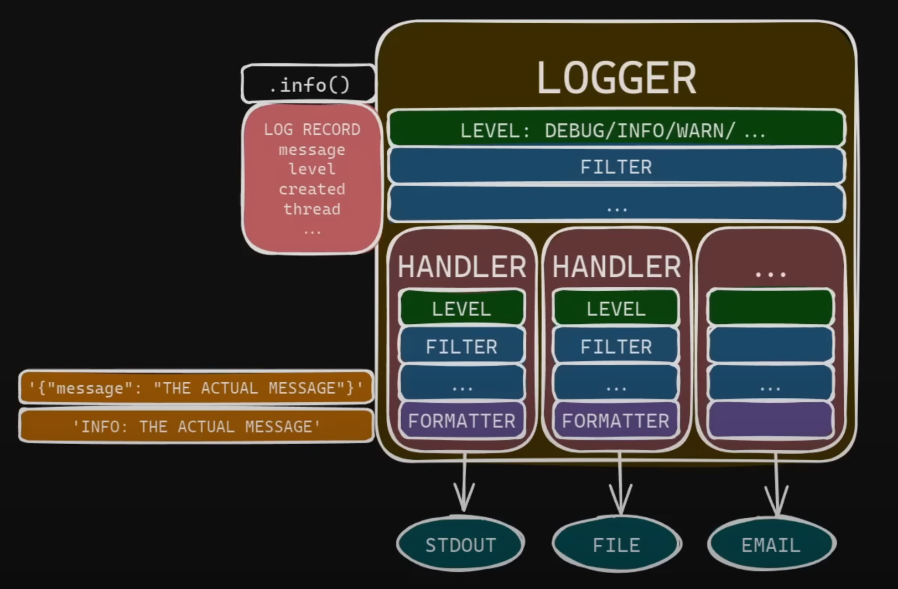
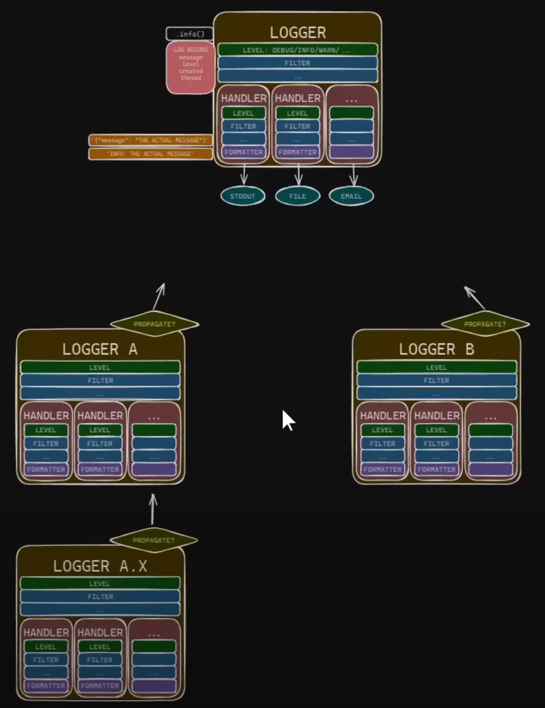

# Modern Python Logging

Notes for "Modern Python Logging" by James Murphy.

video: https://www.youtube.com/watch?v=9L77QExPmI0

>Note 1: This is a really excellent video, much better than many of the other
> ones about this subject.
>> Note2: text below is largely more or less verbatim from the video.

## Introduction
The builtin logging package is the de facto standard for logging in Python.
>"Useful logging is multi-destination" (1:48)

Perhaps you want to log higher priority things like errors and exceptions
differently.

#### Modern Tip #1:
>Don't manually create and add log handlers, use dictConfig(). (2:09)

This let's you explicitly list all the necessary
components of your logging setup namely the filters,
formatters, handlers, and loggers.
The basic config hides these objects and their relationships
from you.
For useful logging it's much clearer to list them explicitly.

## Theory
(2:44)
It can get really confusing if you don't have a good mental model
for what these things actually do.
Here is the one picture to keep in mind to see how it all fits together.

### Loggers and log records
*Loggers* are the things that you actually use in your code.
They have methods like .info() or .debug() or .error() you can call to do logging.
Calling such a method creates a *log record*, which is an object
that contains all kinds of useful contextual information, including message,
severity, current time, current thread, location in the source code, etc.

### Filters
(3:19)
Every logger can set a level to drop all messages below a certain severity
and optionally some *filters* to drop or alter messages along the way.
With a filter you can manipulate log records. You could for example
sensor private user data that isn't supposed to appear in logs.

### Handlers
(3:38)
The logger then passes these log records off to each of its *handlers*
one at a time. Handlers tell you where and how to log a record, like
to stdout, to a file, over e-mail, etc.
Each handler receives the log record and, just like for loggers, the handler
has a level and some filters that allow it to drop or alter the message
along the way.

### Dropping log records
(4:02)
If a log record is dropped by a handler it's still passed to the other handlers.
But if it is dropped by the logger itself, then it is dropped for good.

### Formatters
(4:11)
When it comes time for the handler to actually write the log message,
it needs to write text. So each handler has a *formatter* that it uses
to convert the log record object into a string to be sent out.
Formatters are typically where you see the most customization
because it's the formatter that selects which data from the log record
to actually include in the message. That depends on your specific
use case. 

This is almost the complete picture. Except, this is the picture for the root
logger as in the root of the *tree* of loggers.

## The logging tree 

(5:05)
Loggers are accessed and created by name.
If you split the name by dots you end up with a tree of loggers.
So the A.X logger is a child of the A logger, which is a child of the root.

### Propagation
(5:18)
By default, once a child logger is done handling a log record, it passes that record 
up to its parent. Once again, if a record is dropped by a handler it will continue 
moving on, to include propagating up to the parent. But if it's dropped by a logger, 
then it stops and doesn't propagate.

But all this is usually way more flexibility than you need and unnecessary complex
in most cases.

#### Modern Tip #2:
>(6:17) Don't use non-root handlers, put all handlers on the root logger.

This is simpler, but also having all handlers on the root logger ensures that any 
messages generated by third-party libraries get logged and formatted the same way 
as messages generated by your own application.

Also don't use the non-root filters. Put them all on the root logger or their
handlers, if you even need filters. Leave propagation turned on so that all messages
propagate up to the root logger.

#### Modern Tip #3:
>(6:48) Don't use the root logger directly in your code. Use your own loggers.

So don't use logging.info() and logging.debug() etc.
Instead, use logger.info() where you acquire a non-root logger with logging.getLogger().
This will create the logger first if it doesn't already exist.
Remember, your logger doesn't have any handlers on it. We depend on propagation
to send all events up to the root logger and have the root logger actually handle
the events.

If you have a simple application a single non-root logger is all you need.

#### Modern Tip #4:
>(7:31) One Logger per Major-Subcomponent. (Don't do getLogger(__name__) in every file.)

## Configuring the logging for common setups using dictConfig
(7:45)
The first example setup is to log everything to stdout.

To help you create a log config, first draw out the picture and then use
the picture to fill in the config.

If you don't use any filters in your setup you can delete the filter section.

For formatters, define a formatter named "simple" and give it a simple format string.
By default, it uses the built-in logging.Formatter class.
Next we need to define the single "stdout" handler. Set the simple formatter as the
formatter for this handler.

(9:36)
Despite the fact that we're using dictConfig, that doesn't mean we have to
keep the logging configuration as a dict literal in the Python source code.
Many find it convenient to keep the logging config in a separate file in JSON
or YAML format.

#### Modern Tip #5:
>(9:51) Store config in a separate json or yaml file.

The json is more verbose but the json parser is built into Python.
On the other hand, yaml allows for comments.

Keeping the config in a file also allows the users to adjust
the logging to their preferences. (If you trust your users to do that.)

## Second common setup
(10:44)
Modify the setup so that errors go to stderr and all logs go to a file.

Change the "stdout" handler to "stderr" and set its level to "WARNING".
Then create a new handler and set its class to "RotatingFileHandler".
A RotatingFileHandler keeps appending logs to a file until it reaches a certain size,
and then creates a backup and starts a new file. After reaching the maximum
number of backups it starts deleting the oldest one.

We're still using the simple formatter but since we're logging to a file,
let's include some extra details. We do that by creating a new "detailed"
formatter and set it as the formatter for the "file" handler.

We include much more information in the format string and we can also show
the use of the "datefmt" here, which allows us to customize how dates are printed.

#### Modern Tip #6:
>(12:02) Use ISO-8601 timestamps (with timezone).

This way our log contains a lot more contextual information.
For a lot of applications, this is a great place to stop.

But if you really care about the quality of your log data,
then I really suggest making one crucial change.

The log file can contain tracebacks and messages could contain newlines.
This makes it difficult to parse the log file programmatically.
The solution is to ...

#### Modern Tip #7:
>(12:51) Store persistent logs in json format.

This is the job of a formatter, so we need a JSON formatter.
Alas, there is no built-in logging JSON formatter.
Let's just write our own.

#### Modern Tip #8:
>Add context with logging.info(..., extra={...})

#### Modern Tip #9:
>Log off the main thread, use a queue.

#### Modern Tip #10:
>For libraries don't configure logging.